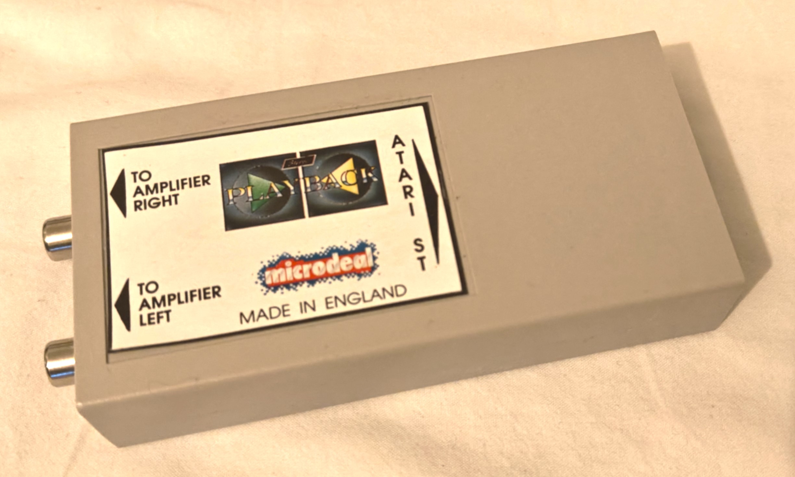
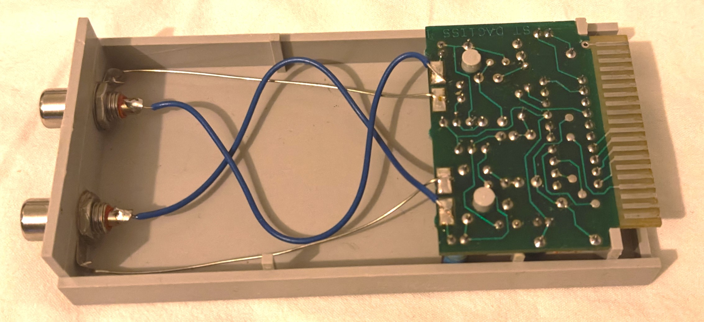
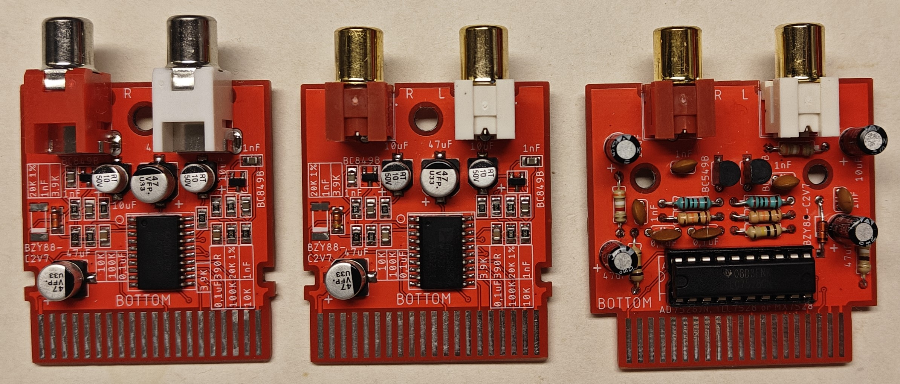
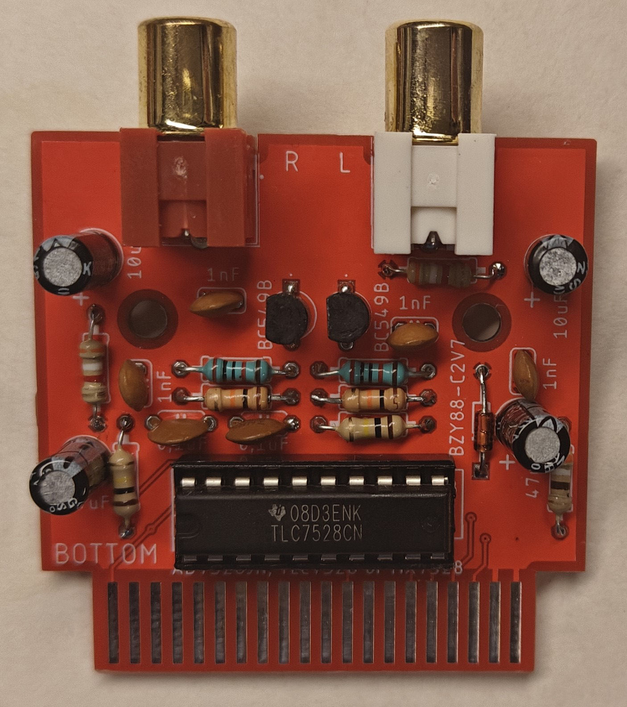
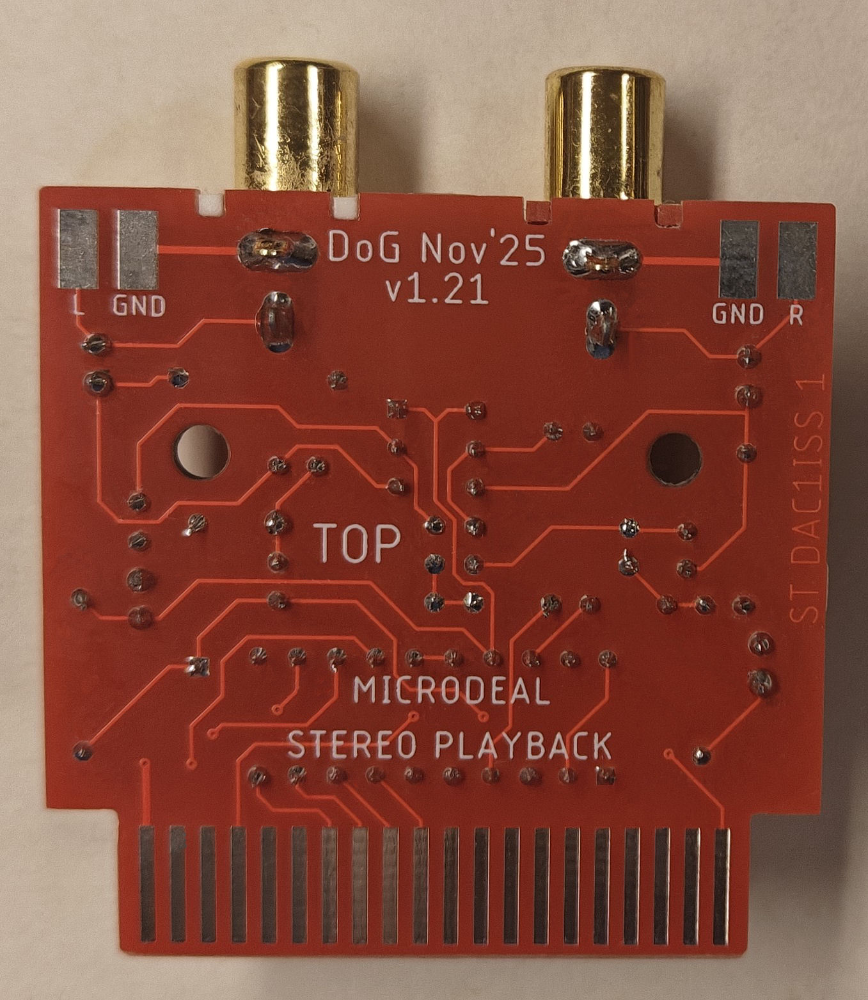
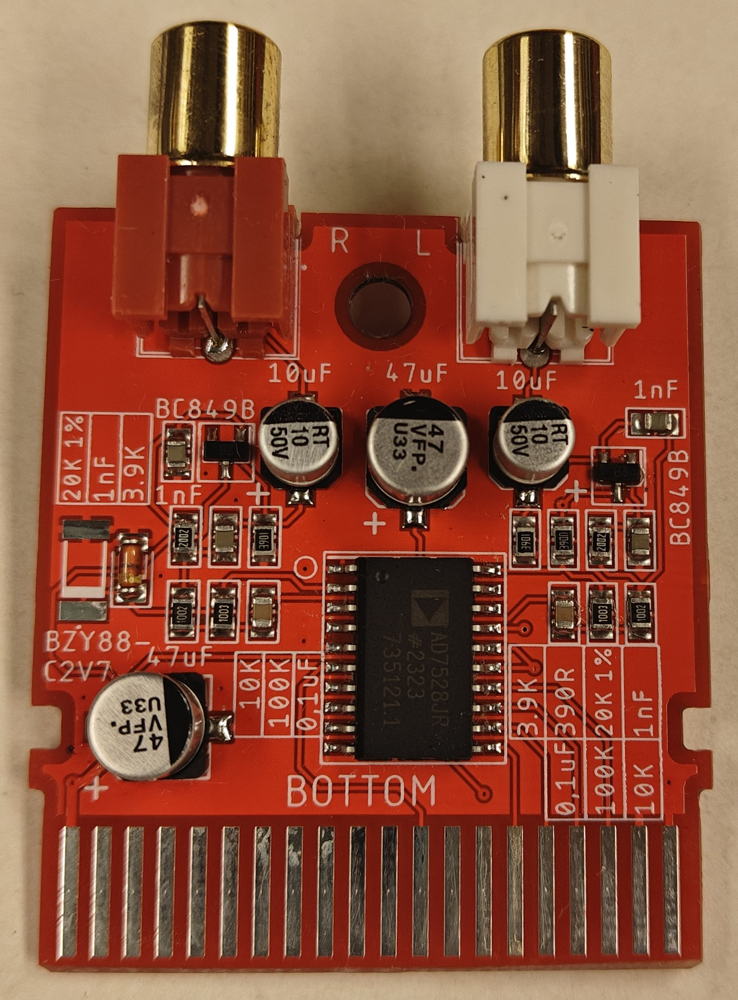
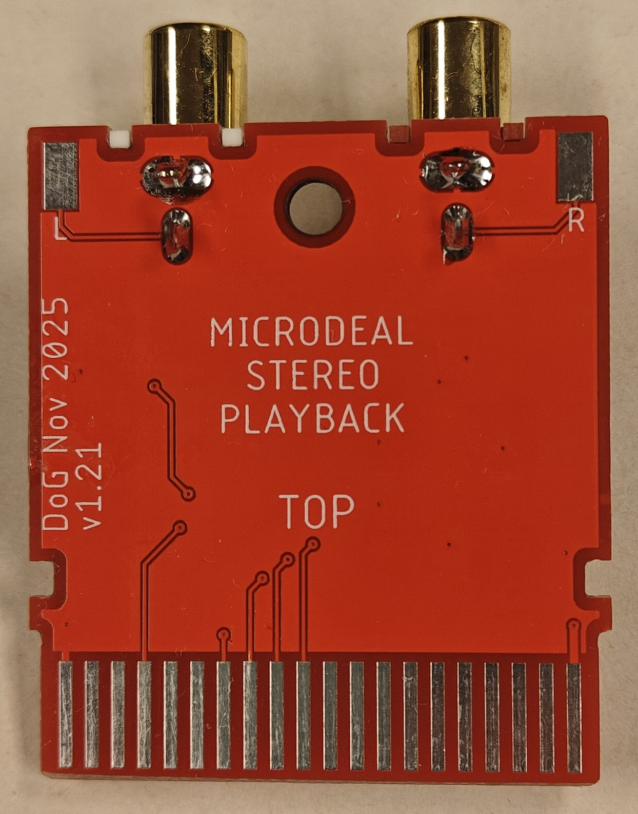
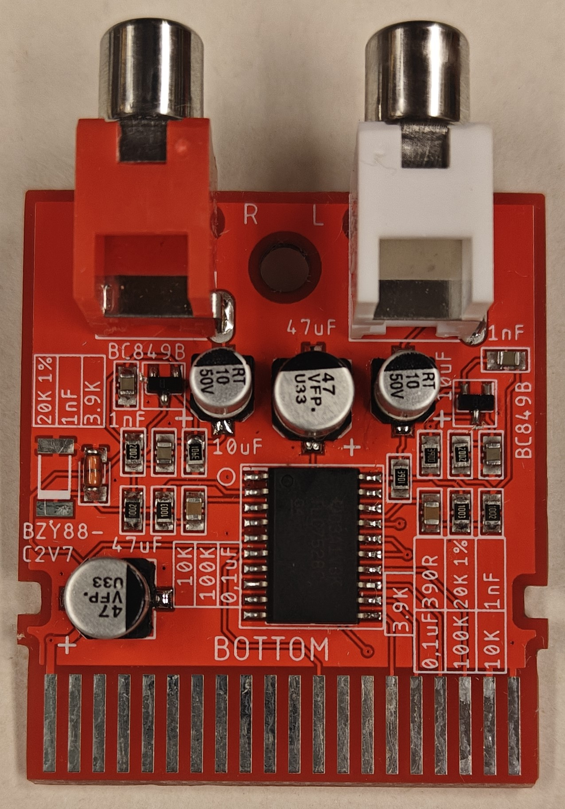
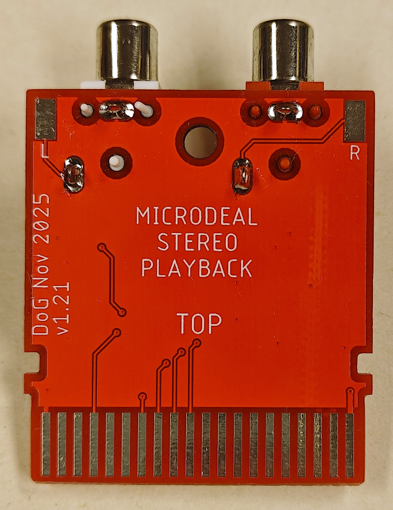

<h1 align="center">
Microdeal Stereo Playback
</h1>

<h2 align="center">
Atari ST stereo playback cartridge from Microdeal. Remake from original cartridge.
</h2>

---
 
  

---
 

---

## Three versions  

All of the threee versions derive from  the same schematics so the sound produced should is the same. I bought the original cartridge with the intention to reverse engineer the cartridge. The through hole versions has more or less the same track and component placement/layout as the original. The two smt versions is the same but two different RCA connector was used. All the pcb's have pads for the signals as well if you want to use panel mount rca jacks. 

---

## Cartridge Orientation
> [!CAUTION]
> 
> ${\color{red}All \space the \space components \space should \space be \space faceing \space down \space when \space inserting \space the \space cartidge \space in \space the \space port! }$  
> 
> I can't stress this enough. As the original, the cartridge "seems" to be upside down. I followed the same design. The silkscreen says what is top and bottom as well.

---

Bill of material (BOM is included in each gerber zip as well as text files in the 'Gerbers' directory)

| Quantity | Value          | Package THT      | Package SMT                        | Device/Description                                            |
| :---     | :---           | :---             | :---                               |:---                                                           |
| 2        | 0,1 µF         | C050-024X044     | C0805                              | Capacitor, ceramic (THT: 5mm leg spacing, SMT: 0805)          |
| 4        | 1 µF           | C050-024X044     | C0805                              | Capacitor, ceramic (THT: 2,5mm leg spacing, SMT: 0805)        |
| 2        | 10 µF          | E2.5-5           | SANYO-OSCON_SMD_B6 ø5x5.4mm     | Electrolytic Capacitor, (THT: 2,5mm leg spacing, ø5x11mm) (SMT: B6 ø5x5,4mm)   |
| 2        | 47 µF          | E2.5-5           | SANYO-OSCON_SMD_C6 ø6.3x5.8mm   | Electrolytic Capacitor, (THT: 2,5mm leg spacing, ø5x11mm) (SMT: B6 ø6,3x5,8mm) |
| 2        | 10 kΩ          | 0207/10          | R0805                              | Resistor, Carbon film (THT: 0,25W 5% tolerance, SMT: 0805)    |
| 2        | 100 kΩ         | 0207/10          | R0805                              | Resistor, Carbon film (THT: 0,25W 5% tolerance, SMT: 0805)    |
| 1        | 390 Ω          | 0207/10          | R0805                              | Resistor, Carbon film (THT: 0,25W 5% tolerance, SMT: 0805)    |
| 2        | 3,9 kΩ         | 0207/10          | R0805                              | Resistor, Carbon film (THT: 0,25W 5% tolerance, SMT: 0805)    |
| 2        | 20 kΩ (1%)     | 0207/10          | R0805                              | Resistor, Metal film (THT: 0,6W 1% tolerance, SMT:0805) (All 0805 is 1% so this doesn't matter) |
| 1        | XXX7528        | DIP20            | SOIC127P1032X265-20N SOIC-20    | AD7528, TLC7528 or MX7528. 2 Channel Digital to Analog Converters - DAC CMOS 8-Bit Buffered Multiplying AD7528 (Analog Devices), TLC7528 (Texas Instrument) or MX7528 (Maxim) will also work. Original have AD7528. |
| 2        | BC549B, BC849B | TO-92            | SOT95P237X125-3N (SOT-23)          | Bipolar Transistor. BJT, 30V, 100mA, NPN. (SMT: I have tried with BC848B as well and it works but sounds a bit different. 849 is low noice. Use 849 if you can)
| 1        | BZY88-C2V7     | DO-35            | MELF3516 or MELF_DO-213AB, SOD80   | Zener Diode 2.7V 500mW (THT: I used BZX55C2V7 in my test built) (SMT: Choose one of the two footprint. 0,5W power dissipation. 2,7V. ±5%. I used a BZV55B2V7 for this one.)
| 2        | RCA Jack       | RCJ-041          | RCJ-041 or WBTOR1                  | RCJ-041: RCA Connector Jack Mono 3.2mm R/A, WBTOR1: RCA connector according to JEITA RC-5231 Cinch |

---

## Enclosure

There is no enclosure at the moment. I'm not a 3D designer. If anyone makes one, please contact me so I can add it to this repository. There is two hole on the THT pcb as the original. I don't think it will fit in the original case. I haven't tested that to be honest. The two SMT versions have one hole and two notches on the side of the pcb. So it should be easy to make an enclosure for it. But what do I know.

---

| Through hole      |    |
| ----------------- | :---:  |
| Surface Mount v1  |    |
| Surface Mount v2  |    |

---

## Testing

I used HexTracker v0.849B to test. ScummVM Lite (Atari) should also work. There is other trackers that also works.

---

PCB made by Daniel Guldkrans aka DoG in Eagle November 2025.

