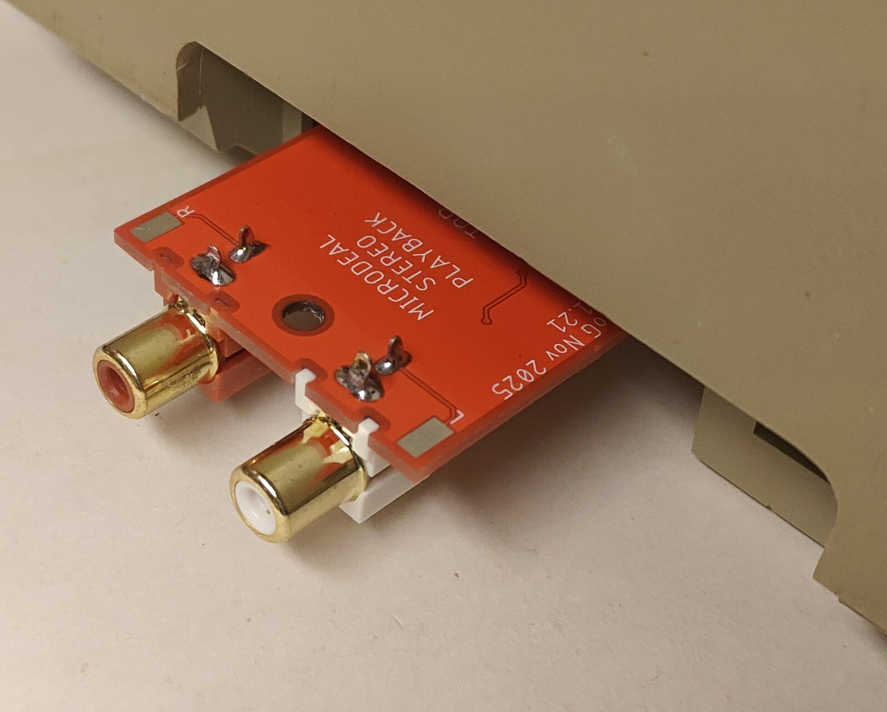
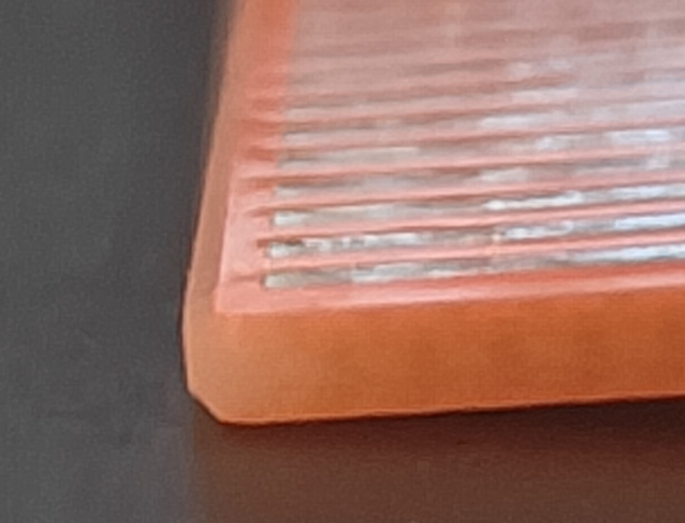
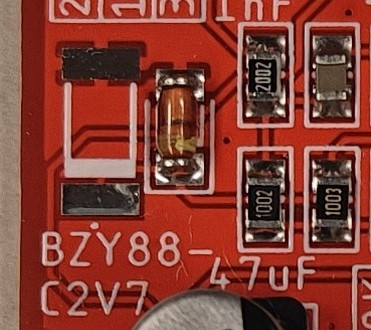
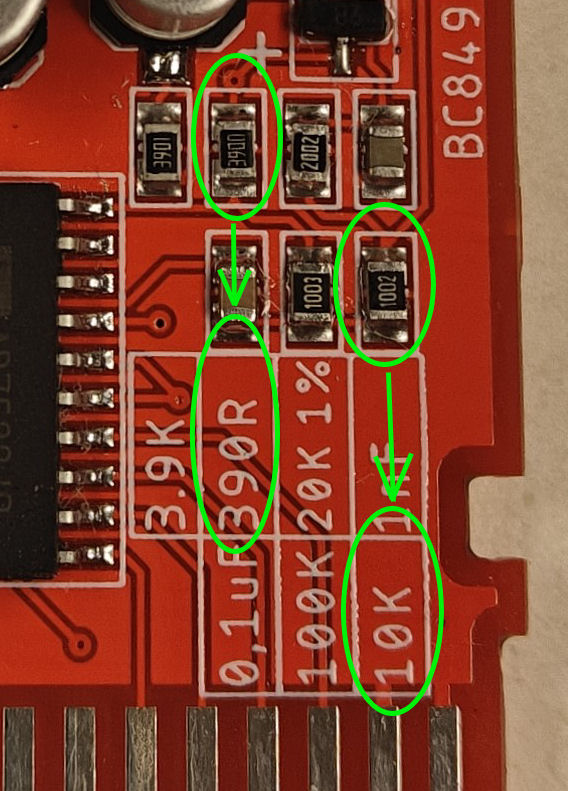

<h1 align="center">
Microdeal Stereo Playback
</h1>

<h2 align="center">
Atari ST stereo playback cartridge from Microdeal. Remake from original cartridge.
</h2>

---
 
  

---
 

---

## Three versions  

I bought the original cartridge with the intention to reverse engineer it. The through hole versions has more or less the same track and component placement/layout as the original. The two smt versions is the same but two different RCA connector was used. All of the three versions derives from the same schematics so the sound produced should be the same. All the pcb's have pads for the signals if you want to use panel mount RCA jacks. But of course you can use the RCA jack holes for that.

---

## Cartridge Orientation
> [!CAUTION] 
> 
> ${\color{red}All \space the \space components \space should \space be \space faceing \space down \space when \space inserting \space the \space cartidge \space in \space the \space port! }$  
> 
> I can't stress this enough. As the original, the cartridge "seems" to be upside down. I followed the same design. The silkscreen says what is top and bottom as well.

---

## BOM

Bill of material (BOM is included in each gerber zip as well as text files in the 'Gerbers' directory)

| Quantity | Value              | Package THT      | Package SMT                        | Device/Description                                            |
| :---     | :---               | :---             | :---                               |:---                                                           |
| 2        | 0,1 µF             | C050-024X044     | C0805                              | Capacitor, ceramic (THT: 5mm leg spacing, SMT: 0805)          |
| 4        | 1 µF               | C050-024X044     | C0805                              | Capacitor, ceramic (THT: 2,5mm leg spacing, SMT: 0805)        |
| 2        | 10 µF, 16V or more | E2.5-5           | SANYO-OSCON_SMD_B6 ø5x5.4mm     | Electrolytic Capacitor, (THT: 2,5mm leg spacing, ø5x11mm) (SMT: B6 ø5x5,4mm)   |
| 2        | 47 µF, 16V or more | E2.5-5           | SANYO-OSCON_SMD_C6 ø6.3x5.8mm   | Electrolytic Capacitor, (THT: 2,5mm leg spacing, ø5x11mm) (SMT: B6 ø6,3x5,8mm) |
| 2        | 10 kΩ              | 0207/10          | R0805                              | Resistor, Carbon film (THT: 0,25W 5% tolerance, SMT: 0805)    |
| 2        | 100 kΩ             | 0207/10          | R0805                              | Resistor, Carbon film (THT: 0,25W 5% tolerance, SMT: 0805)    |
| 1        | 390 Ω              | 0207/10          | R0805                              | Resistor, Carbon film (THT: 0,25W 5% tolerance, SMT: 0805)    |
| 2        | 3,9 kΩ             | 0207/10          | R0805                              | Resistor, Carbon film (THT: 0,25W 5% tolerance, SMT: 0805)    |
| 2        | 20 kΩ (1%)         | 0207/10          | R0805                              | Resistor, Metal film (THT: 0,6W 1% tolerance, SMT:0805) (All 0805 is 1% so it doesn't apply here) |
| 1        | XXX7528            | DIP20            | SOIC127P1032X265-20N SOIC-20    | AD7528, TLC7528 or MX7528. 2 Channel Digital to Analog Converters - CMOS 8-Bit Buffered Multiplying DAC. AD7528 (Analog Devices), TLC7528 (Texas Instrument) or MX7528 (Maxim) will also work. Original have AD7528. I have tried with AD and TLC. |
| 2        | THT: BC549B, SMT: BC849B | TO-92            | SOT95P237X125-3N (SOT-23)          | Bipolar Transistor. BJT, 30V, 100mA, NPN. (SMT: I have tried with BC848B as well and it works but sounds a bit different. 849 is low noice. Use 849 if you can)
| 1        | BZY88-C2V7         | DO-35            | MELF3516 or MELF_DO-213AB, SOD80   | Zener Diode 2.7V 500mW (THT: I used BZX55C2V7 in my test built) (SMT: Choose one of the two footprint. 0,5W power dissipation. 2,7V. ±5%. I used a BZV55B2V7 for this one.)
| 2        | RCA Jack           | RCJ-041          | RCJ-041 or WBTOR1                  | THT and v1: Red:RCJ-042, White:RCJ-043 - RCA Connector Jack Mono 3.2mm R/A [AliEx](https://www.aliexpress.com/w/wholesale-RCA%2525252d105.html), v2: WBTOR1 Lumberg. [AliEx](https://www.aliexpress.com/w/wholesale-AV%2525252d8.4%2525252d9-.html) |

---

## Enclosure

There is no enclosure at the moment. If anyone makes one, please contact me so I can add it to this repository. There is two hole on the THT pcb as the original. I don't think it will fit in the original case. I haven't tested that though. The two SMT versions have one hole and two notches on the side of the pcb. So it should be easy to make an enclosure for it. But what do I know, I'm not a 3D designer.

---

## Tips and help

| [Through hole] [THT BOM]      |    |
| :--- | :---:  |
| [Surface Mount v1] [SMT v1 BOM]  |    |
| [Surface Mount v2] [SMT v2 BOM] The RCA jack has a very tight fit. v1 is easier to build. |    |
|                   |   |
| SMT: I would suggest to use a file to chamfer the edge of the connector to easier put it in the cartridge port. |  |
| SMT: Choose one of the diode on the pcb. ${\color{red}Don't \space use \space both!}$ |  |
| SMT: The components are crammed together in a grid which corresponds to the silkscreen grid. Otherwise just look at the picture of the board you choose to build. |  |
---

The disk that was included in the box can be found at [Atari Mania](https://www.atarimania.com/utility-atari-st-playback_25563.html) 
[PDF with multiple labels](Labels/Microdeal%20Stereo%20Playback%20label.pdf)  
Label for cartridge (size ca: 39,6 mm x 57 mm) is included in the [label](Labels/Sticker%2039,6mmx57mm.jpg) folder.  
More photos can be found in the [Pics](Pics/) folder.  
Datasheets for some of the components used in the original or the new design can be found in the [Datasheets](Datasheets/) folder.  
All three PCB unpopulated: [TOP](Pics/3v_pcb_top.jpg), [BOTTOM](Pics/3v_pcb_bottom.jpg).

---

## Testing

I used HexTracker v0.849B to test the cartridge. [ScummVM lite](https://www.happydaze.se/scummvm-lite-atari/) (Atari) should also work. There is other trackers that also works. 

---

PCB made by Daniel Guldkrans aka DoG in Eagle November 2025.

[Through hole]: Gerbers/Microdeal_Stereo_Playback_v1.21_THT.zip
[THT BOM]: Gerbers/Microdeal_Stereo_Playback_v1.21_THT_BOM.txt
[Surface Mount v1]: Gerbers/Microdeal_Stereo_Playback_SMT_v1.21_v1.zip
[SMT v1 BOM]: Gerbers/Microdeal_Stereo_Playback_SMT_v1.21_v1_BOM.txt
[Surface Mount v2]: Gerbers/Microdeal_Stereo_Playback_SMT_v1.21_v2.zip
[SMT v2 BOM]: Gerbers/Microdeal_Stereo_Playback_SMT_v1.21_v2_BOM.txt
